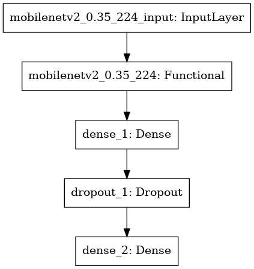

# ImageClassifier

Use Neural Networks (mobilenet) to automatically classify fruits on webcam and have the predictions on the camera frame.. 

## Usage
python.exe capture.py 

take a fruit infront of the webcam (press `p`) and have the predictions on the frame

exit the program with `q`

After exiting, you also get the predictions of the pretrained model predictions. 
